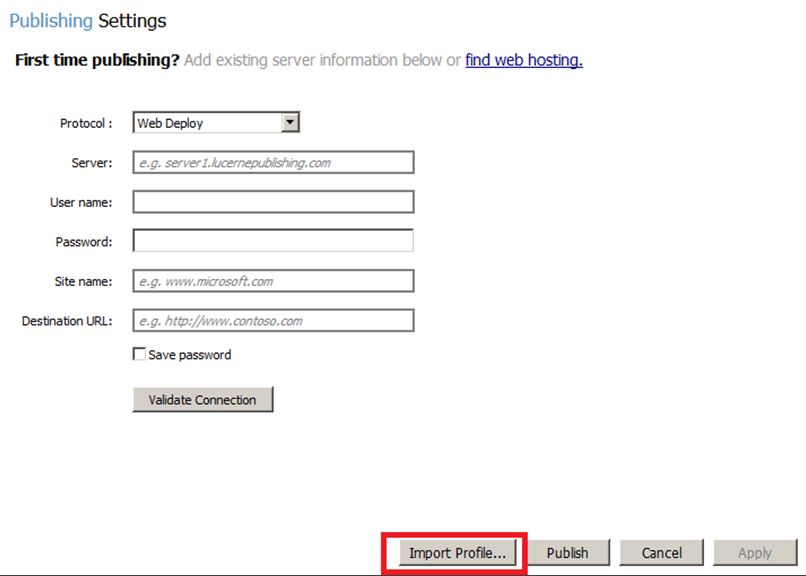
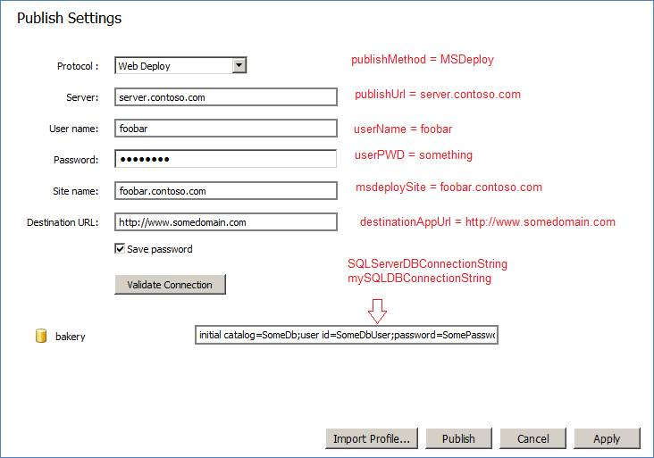
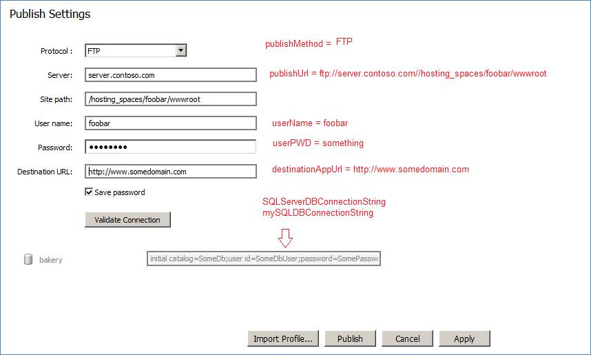

Generate a Profile XML File
====================
by Bilal Aslam

## Generate a Profile XML File

When a user signs up for an account, your welcome email should contain an attachment containing account settings (also known as a Profile XML file) that can be imported into WebMatrix so the user can easily publish to their new site.

- The extension of the file should be **.publishsettings**
- The file should contain at most *one* Web Deploy profile, and at most *one* FTP profile.
- If both Web Deploy and FTP profiles are present, WebMatrix will pick the Web Deploy profile, but the user will be able to switch to FTP later if they so choose.
- Database connection strings (SQLServerDBConnectionString, mySQLDBConnectionString) should be **duplicated** between Web Deploy and FTP profiles.

### Example File

Example profile XML that describes two independent sets of publishing settings, one for Web Deploy and one for FTP **(this is a preliminary schema and is subject to change until WebMatrix v1 is released)**:

[!code-xml[Main](generate-a-profile-xml-file/samples/sample1.xml)]

[!code-unknown[Main](generate-a-profile-xml-file/samples/sample-127505-2.unknown)]

[!code-unknown[Main](generate-a-profile-xml-file/samples/sample-127505-3.unknown)]

[!code-unknown[Main](generate-a-profile-xml-file/samples/sample-127505-4.unknown)]

### Schema Definition

| **Attribute** | **Comments** |
| --- | --- |
| profileName | *Optional. Used by Visual Studio only.* *Valid values: String containing only characters valid in Win32 filenames* A name to refer to this profile by; shown in Visual Studio. |
| publishMethod | *Required for all profiles.* *Valid values: MSDeploy, FTP* WebMatrix does not support the FTPS protocol. |
| PublishURL | *Required for all profiles.* If publishMethod is "MSDeploy", this is simply the URL of the Web Management Service (wmsvc) endpoint. For example: - server.contoso.com - server.contoso.com:8080 (e.g. if you are using a non-standard port 8080 for wmsvc) If publishMethod is "FTP", this is the URL of the FTP server. If your FTP server is configured to change-directory the user to the appropriate root physical folder for their site upon login, then this can simply be the URL of the FTP server e.g. "ftp://ftp.contoso.com:21" Otherwise, you need to specify the site root path (this shows up as the "Site path" setting in the WebMatrix Publish Settings dialog when the protocol is FTP). This can be done in one of two ways: - Relative: ftp://ftp.contoso.com:21 ***/username/wwwroot*** - Absolute: ftp://ftp.contoso.com:21 ***//hosting\_spaces/username/wwwroot*** |
| msdeploySite | *Required for Web Deploy profile.* This is the name of the IIS site the user is publishing to. |
| ftpPassiveMode | *Optional, only applies to a profile where publishMethod is "FTP".* Specifies whether WebMatrix should connect using FTP passive mode or not. If omitted, the default is to connect with passive mode. |
| userName | *Required for all profiles.* |
| userPWD | *Optional. This is a plain text (i.e. not encrypted) string.* |
| destinationAppUrl | *Required for all profiles.* This is the public-facing URL of the customer's site. This is required for Publish Compatibility tests. Moreover, several applications such as Wordpress require the destinationAppUrl to be inserted into the database for the application to function correctly. WebMatrix does this insertion automatically, hence this field is required. |
| SQLServerDBConnectionString | *Optional, but highly recommended for ease of publishing.* WebMatrix will use this database connection string to publish Microsoft SQL Server databases. We recommend that you pre-create the database when the user signs up for an account so they do not have to do this themselves from the hosting provider control panel. |
| mySQLDBConnectionString | *Optional, but highly recommended for ease of publishing.* WebMatrix will use this database connection string to publish MySQL databases. We recommend that you pre-create the database when the user signs up for an account so they do not have to do this themselves from the hosting provider control panel. |
| hostingProviderForumLink | *Optional, but recommended.* If provided, this URL will show up in the Publish Compatibility wizard. Providing this link can reduce your support cost by guiding users to online help in case they have problems publishing the site. |
| controlPanelLink | *Optional, but recommended.* If provided, this URL will show up in various places in WebMatrix. It provides users with an easy way to launch the hosting provider's control panel in a browser. |

### Extra Information

You'll notice that there is an XML comment section at the bottom of the file that includes extra information:

- **Control Panel credentials** - the username and password used to log into the Control Panel used to manage the site
- **Technical Contacts** - a support alias or the contact e-mail of a company representative

This is generally *optional*, but useful to your customers since they can keep their control panel credentials and have a support e-mail address stored along with their publishing credentials in one file.

This information is actually *required* in the instance of the Profile XML file given to the [Web Hosting Gallery](https://www.microsoft.com/web/hosting/home "Web Hosting Gallery") team with the submission of an offer for consideration.

### How it works with WebMatrix

To test that your profile XML works:

1. Start WebMatrix
2. Create a new site
3. Click the Publish button in the ribbon
4. Click the "Import Profile…" button  
  
    
5. Choose a profile, import it and click "Validate Connection" to make sure that the profile was imported correctly.

The items in the Publish Settings dialog should be filled out automatically according to the following mapping:

#### Web Deploy Settings Mapping

#### FTP Settings Matching

## Next Steps

Once you are able to generate Profile XML files easily, you should [include them in the welcome e-mails](create-welcome-e-mails.md) that you send to users who create new accounts on your service.
  
  
[Discuss in IIS Forums](https://forums.iis.net/1157.aspx)