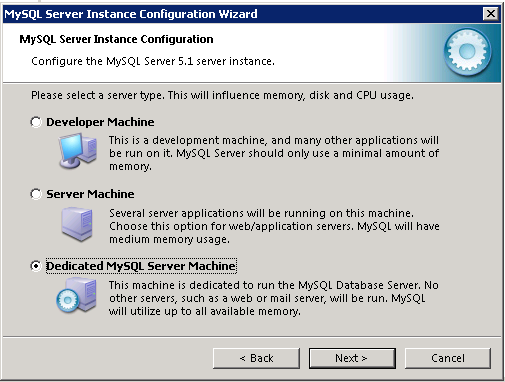
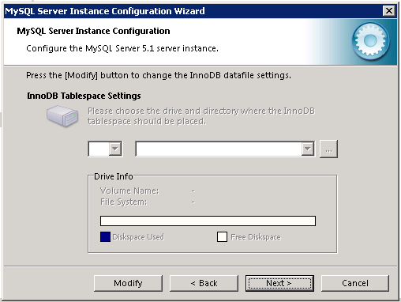
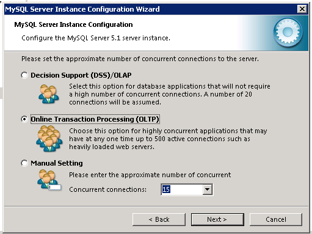
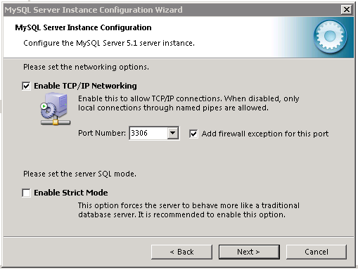
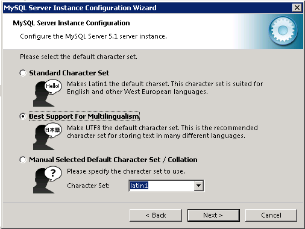
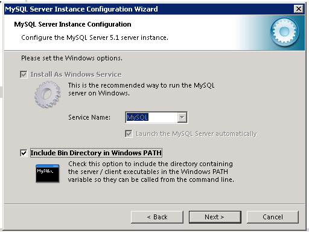

Setup MySQL with WebMatrix Support
====================
by [Bilal Aslam](https://github.com/bilalaslam)

## MySQL Installation

WebPI supports installing MySQL in developer mode, but this is not suitable for a shared hosting environment.

Instead, you should download the latest stable version of MySQL from the [official website](http://www.mysql.com/ "MySQL website") and install it on a **dedicated database server** with these settings:

For concurrent connections, choose OLTP since that reflects the workload of a typical shared hosting database server:

Enable TCP/IP networking, add the firewall exception and disable the strict mode:

Enable UTF-8 character set – ***this is very important***, because several applications in the Web Application Gallery require UTF-8 support in the database:

Since MySQL is installed on the database server, which is different than the web server which runs the Web Deploy web server component, you'll need to take a few extra steps to make sure Web Deploy can access the database server:

1. Copy mysqldump.exe (typically from C:\Program Files\MySQL\MySQL Server 5.1\bin) to your **web server** in [c:\mysqldump\mysqldump.exe](file:///c:/mysqldump/mysqldump.exe)
2. On the **web server**, set a registry key (HKEY\_LOCAL\_MACHINE\SOFTWARE\Microsoft\IIS Extensions\MSDeploy\2\mysqldumppath) to string value == "c:\mysqldump\mysqldump.exe")

## Resetting Permissions

If you happen to lose the credentials to your MySQL database, this article may help:

[http://dev.mysql.com/doc/refman/5.1/en/resetting-permissions.html#resetting-permissions-windows](http://dev.mysql.com/doc/refman/5.1/en/resetting-permissions.html#resetting-permissions-windows)
  
  
[Discuss in IIS Forums](https://forums.iis.net/1157.aspx)