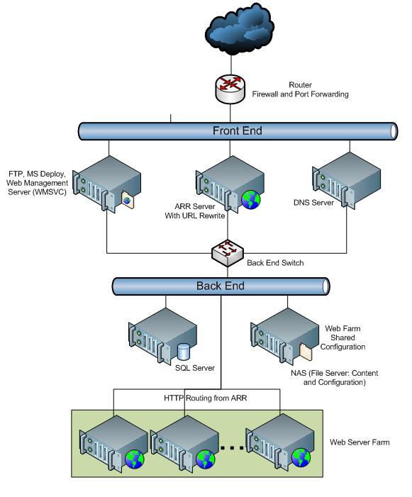
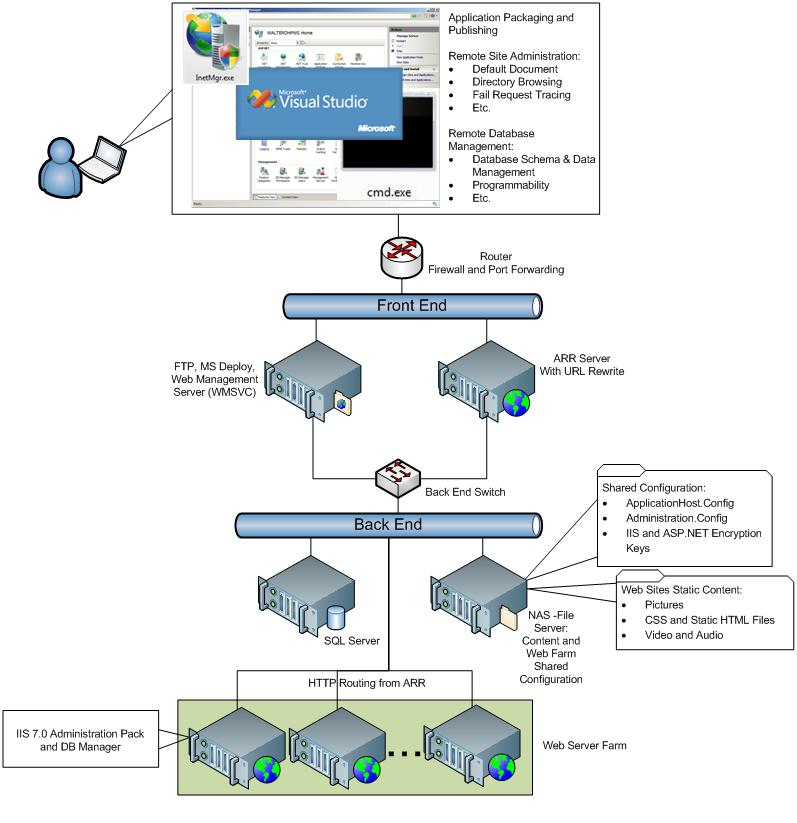
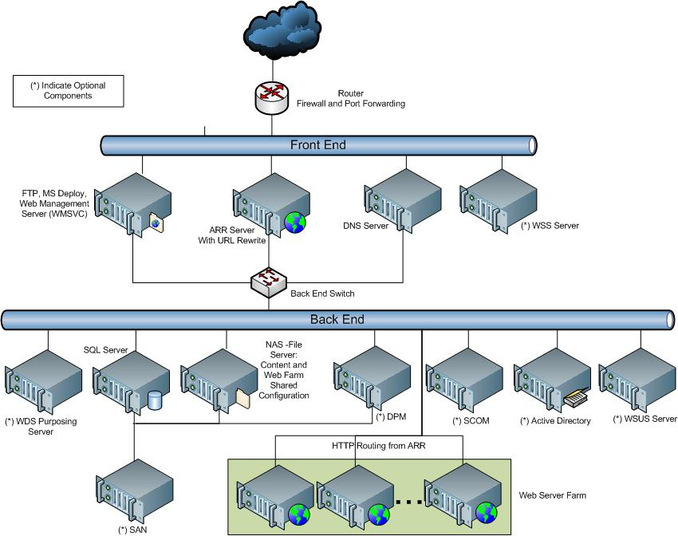

Shared Hosting Configuration
====================
by [Walter Oliver](https://github.com/walterov)

## Overview

Hosting multiple Web sites or databases on a single computer is challenging. Hosters may struggle with quality of service, site density, security, and performance configuration. This article describes the Shared Hosting Configuration components that are needed to address these requirements. The goal is to provide a high-level picture of the components, how they fit together, and why they are important. For specific feature information or guidance, see the links in each description.

### Contents

[Environment Architecture](shared-hosting-configuration.md#envarch)

> [Network Segments](shared-hosting-configuration.md#NetSeg)

> [Core Architecture](shared-hosting-configuration.md#CoreArc)

> > [Front End Servers](shared-hosting-configuration.md#CoreArcFE)
> > 
> > [Back End Servers](shared-hosting-configuration.md#CoreArcBE)

> [Remote Administration](shared-hosting-configuration.md#RetAdmin)

> [Enhanced Architecture (Optional Components)](shared-hosting-configuration.md#EnhArc)

> > [Optional Front End Servers](shared-hosting-configuration.md#EnhArcFE)

> > [Optional Back End Servers](shared-hosting-configuration.md#EnhArcBE)

[Conclusion](shared-hosting-configuration.md#Conclusion)

## Environment Architecture

Microsoft provides a rich set of technologies that address all aspects of hosting. The following sections describe the recommended architecture configuration and provide individual descriptions about each component.

### Network Segments

As shown in the diagrams found later in this topic, Windows Web Platform Shared Hosting environments typically include the following network segments:

- **Front-end** The front-end includes the servers that interface with customers to provide access to hosted services offered in the solution. All internet-specific traffic is isolated to the front end segment.
- **Back-end** The back-end isolates Web farm access, management, database access, monitoring, and security data from the customer accessing the front end segment. This helps to enhance network security and performance.

### Core Architecture

Often, service providers are interested in the core set of components that are required for their hosting offering. Their goal is speed to market without sacrificing quality of service, availability, and performance. The following diagram depicts the minimum configuration that you must have to deploy a complete Shared Hosting environment.  
 

#### Front End Servers

##### Application Request Routing (ARR) Server

The [ARR server runs the Microsoft Application Request Routing for IIS module](../configuring-servers-in-the-windows-web-platform/application-request-routing-arr-20-for-shared-hosting.md). This is a proxy-based routing module that forwards HTTP requests to content servers based on HTTP headers, server variables, and load balance algorithms. ARR can be used to:

- Increase application availability and scalability.
- Better use content server resources.
- Facilitate application deployment, including pilot management and A/B testing.
- Lower management costs and create opportunities for shared hosters.

The ARR server is deployed and managed by the hoster. Since ARR 2.0 is a feature of IIS, you may decide to manage it by using Remote Administration (see the Remote Administration section later in this topic) or Terminal Services. Depending on the scalability and availability requirements, administrators may need a configuration that includes either or both [Network Load Balancing](https://technet.microsoft.com/en-us/library/cc732855.aspx "Network Load Balancing") and [Failover Clusters](https://technet.microsoft.com/en-us/library/cc732855.aspx "Failover Clusters") on the ARR server. Load balance routers for two or more ARR servers can also be examined for such requirements.

See this [section](../../extensions/planning-for-arr/using-the-application-request-routing-module.md) for further guidance about ARR.

###### SSL Offloading

By default, SSL Offloading is enabled on the ARR server. This feature helps to maximize the server resources because the Web servers do not have to spend cycles encrypting and decrypting requests and responses. Enabling SSL Offloading implies that all communication between the ARR server and the Web servers is accomplished in clear text, even for HTTPS requests from the clients to the ARR server. All of the Web servers are located in the back end network because this is a trusted network that preserves the security of the communication between the ARR server and the Web farm.

##### Web Management Service, MS Deploy, and FTP Server

This server runs the services that users need to publish and manage their content and Web applications from the command line, IIS Manager UI, or Visual Studio Development environment. Three IIS services run on this server:

- Web Management Service, also known as WMSVC, makes Remote Administration possible. See the corresponding section [below](shared-hosting-configuration.md#RetAdmin).
- [File Transfer Protocol (FTP) Server](../configuring-servers-in-the-windows-web-platform/guide-to-deploy-ftp-and-publish-with-vwd.md) provides the infrastructure that is required to create an FTP site where users can upload and download files by using the FTP protocol and appropriate client software. FTP uses TCP/IP to distribute files similarly to how HTTP works to distribute Web pages. An FTP site is especially useful for offering customers the ability to upload files.
- [Web Deploy](../../publish/deploying-application-packages/index.md) simplifies the deployment, management, and migration of Web applications. It lets administrators enable developers to publish their Web applications and databases to the hosted environment.

The Web Management Service, MS Deploy, and FTP server is connected to the Internet through the network. Through a separate NIC interface, it also has access to the NAS server that contains the shared configuration of the Web server farm. Depending on the scalability and availability requirements, administrators can decide to use either or both [Network Load Balancing](https://technet.microsoft.com/en-us/library/cc732855.aspx "Network Load Balancing") and [Failover Clusters](https://technet.microsoft.com/en-us/library/cc732855.aspx "Failover Clusters") on this server.

##### DNS Server

The [DNS Server role in Windows Server 2008](../installing-infrastructure-components/dns-server.md) combines support for standard DNS protocols with the benefits of integration with Active Directory Domain Services (ADDS) and other Windows networking and security features, including advanced capabilities such as secure dynamic updating of DNS resource records.

##### Router Firewall and Port Forwarding

This firewall router forwards FTP and Web Management (port 8172) traffic to the corresponding server. If applications offered by the hoster, such as mail, are available in the front end network, this router will also forward that traffic to the appropriate servers. All other Web application traffic is routed to the ARR server.

#### Back End Servers

##### Web Server

The [Web server](../web-server-for-shared-hosting/index.md) runs the Windows Server 2008 Web server role. Windows Server 2008 delivers IIS, which is a unified Web platform that integrates IIS, ASP.NET, and Windows Communication Foundation. It provides the functionality to deploy [multi-tenant (Shared Hosting) offerings](../web-server-for-shared-hosting/index.md). All Web applications share the Web server resources. The key features and improvements in IIS include the following:

- A unified Web platform that delivers a single, consistent Web solution for both administrators and developers.
- Enhanced security and the ability to customize the server to reduce the attack surface.
- Simplified diagnostic and troubleshooting features that aid in the resolution of problems.
- Improved configuration and support for server farms.
- Delegated administration for hosting and enterprise workloads.

The ARR server controls all traffic coming to the Web servers. The ARR server handles all the HTTPS work, effectively offloading it from the Web servers (see SSL Offloading earlier in this topic). Web servers are grouped in a Web farm and should be put in a protected network, such as the back end network. This is important because the communication between the ARR server and the Web server is in clear text when ARR's SSL Offloading is used.

##### Web Server Farm

The [Web Server Farm](../configuring-servers-in-the-windows-web-platform/index.md) is a collection of Web servers that share a common configuration and a set of Web sites. In IIS, Web farms are supported through the [Shared Configuration](../configuring-servers-in-the-windows-web-platform/shared-configuration_211.md) feature, which enables administrators to store the IIS server configuration files on a remote share (NAS File Server). This provides the ability to replicate and synchronize configuration among the Web servers in the farm. In combination with the ARR server, the Web farm provides the configuration that is required to implement Shared Hosting environments. To protect communication with the ARR server, the Web server farm is located in the back end network.

##### File Server (NAS)

The [file server](../configuring-servers-in-the-windows-web-platform/index.md) provides a central location on the network where you can store and share files with other servers. You can use this server to store the Web server farm shared configuration and static content for Web sites. The file server can act as a network-attached storage (NAS) unit. This server is required to set up the Web farm (shared configuration) environment. All the servers in the Web farm and the Web management server have access to the file server for application content and configuration data. Depending on scalability and availability requirements, administrators can decide to implement either or both [Network Load Balancing](https://technet.microsoft.com/en-us/library/cc732855.aspx "Network Load Balancing") and [Failover Clusters](https://technet.microsoft.com/en-us/library/cc732855.aspx "Failover Clusters") on this server.

##### SQL Server 2008

[SQL Server 2008](../configuring-servers-in-the-windows-web-platform/sql-2008-for-hosters.md) provides database services to the Web servers. For example, the dynamic content for Web sites is stored in SQL Server databases. SQL Server 2008 is an ideal database platform for use in shared and dedicated Web hosting environments; it provides features to optimize security, tenant isolation, and improve the performance of the hosted SQL Server 2008 deployment.

### Remote Administration

Remote Administration is a key feature of the set of [IIS Management and Administration](../../manage/provisioning-and-managing-iis/iis-management-and-administration.md) capabilities. With [IIS Remote Administration](../../manage/remote-administration/index.md), hosters can empower their customers to manage their Web applications and corresponding database(s) remotely. This is possible because of these key features in IIS:

1. [IIS Manager Remote Administration](../../manage/remote-administration/remote-administration-for-iis-manager.md). [IIS Manager](../../get-started/getting-started-with-iis/getting-started-with-the-iis-manager-in-iis-7-and-iis-8.md) can manage remote servers, sites, and applications.
2. [Delegated Administration](../../manage/managing-your-configuration-settings/index.md) lets administrators enable site and application owners to modify specific settings. The effect of these changes is confined to the specific site or application. This model introduces the concept of self-contained applications, which lets the site or application directory house both content and configuration settings. For step-by-step instructions about how to enable Delegated Administration, see [How to Use Configuration Delegation in IIS](../../manage/managing-your-configuration-settings/how-to-use-configuration-delegation-in-iis.md) and [Configuring Remote Administration and Feature Delegation in IIS](../../manage/remote-administration/configuring-remote-administration-and-feature-delegation-in-iis-7.md).
3. [IIS Extensible Architecture](iis-extensibility.md) enables the [development and deployment of pluggable IIS modules](../../develop/index.md), such as the [Database Manager](../web-server-for-shared-hosting/database-manager-for-hosters.md), or modules such as those available in the [IIS Administration Pack](../web-server-for-shared-hosting/administration-pack.md). The Database Manager module lets you take an existing database connection and manage your database from IIS Manager. You can also perform basic operations such as editing tables, adding keys, and running queries.
4. [Web Deploy](../../publish/deploying-application-packages/index.md) lets users package and deploy Web applications and databases onto hosted environments.  
The following diagram depicts the Remote Administration configuration.

### Enhanced Architecture (Optional Components)

In some cases, service providers want to achieve the maximum degree of manageability, monitoring, and automation. These requirements can be met by adding a set of optional components to the core architecture described earlier in this article. This environment configuration may be required by hosters managing large datacenter facilities across multiple geographical locations. The following diagram depicts an enhanced architecture for Shared Hosting environments.

#### Optional Front End Servers

##### WSS Server (Optional)

The [Windows SharePoint Services](../configuring-servers-in-the-windows-web-platform/windows-sharepoint-services-for-shared-hosting.md "Windows SharePoint Services") (WSS) server provides a scalable, manageable platform for the collaboration and development of Web-based business applications. WSS lets teams share documents, track tasks, use e-mail efficiently and effectively, and share ideas and information. Service providers frequently offer this technology to their customers.

#### Optional Back End Servers

##### WDS Purposing Server (Optional)

[Windows Deployment Services](../installing-infrastructure-components/introduction-to-deploying-windows-server-2008-r2.md#UsingWDS "Windows Deployment Services") (WDS) assists with the rapid deployment of Microsoft Windows operating systems. WDS is useful for setting up new computers through a network-based installation without having to be physically present at each computer and without having to install directly from CD or DVD media. Hosting companies can use the WDS purposing server to prepare, configure, and deploy multiple servers automatically. The purposing server communicates with all servers on the front end and back end.

##### Active Directory (Optional)

[Active Directory Domain Services](https://technet.microsoft.com/en-us/library/cc731053.aspx "Active Directory Domain Services") (ADDS) stores directory data and manages communication between users and domains, including user login processes, authentication, and directory searches. An Active Directory domain controller is a server that is running ADDS. It provides a distributed database that stores and manages information about network resources and application-specific data from directory-enabled applications such as Microsoft Exchange. Administrators can use ADDS to organize elements of a network, such as users, computers, and other devices, into a hierarchical containment structure. AD can also be useful when you [deploy network resources](../installing-infrastructure-components/index.md "deploy network resources") in a Shared Hosting environment.

##### System Center Virtual Machine (VMM) and Operations (SCOM) Manager (Optional)

Hosters may decide to deploy System Center VMM and SCOM when managing large hosting facilities. SCOM provides end-to-end monitoring for the hosting datacenter environment. SCOM can monitor thousands of servers, applications, and client computers, and provides comprehensive views of the datacenter environment health states. These views are needed to facilitate rapid response to events that can affect the availability of services that a hoster provides. VMM provides a complete environment to deploy and manage Virtual Machines.

##### Microsoft Windows Server Update Services (WSUS) (Optional)

[Microsoft Windows Server Update Services](https://technet.microsoft.com/en-us/wsus/default.aspx "Microsoft Windows Server Update Services") (WSUS) lets administrators at hosting companies deploy the latest Microsoft product updates to computers that are running the Windows operating system. By using [WSUS](../installing-infrastructure-components/deploying-updates-with-wsus-30.md "WSUS"), administrators can fully manage the distribution of updates that are released through Microsoft Update to computers in their network.

##### System Center Data Protection Manager (DPM) (Optional)

[System Center Data Protection Manager](https://technet.microsoft.com/en-us/dpm/default.aspx "System Center Data Protection Manager") (DPM) is a complete solution for Windows backup and recovery. It provides continuous data protection for Microsoft application and file servers that use seamlessly integrated disk and tape media. DPM enables rapid and reliable recovery.

##### Storage Area Network (SAN) (Optional)

Storage Area Network (SAN) lets administrators attach remote computer storage devices (disk, tapes, etc.) to servers that are located across the network. These storage devices then appear as local to these servers. Hosters can decide to deploy SAN to achieve highly scalable and flexible storage resource allocation, high efficiency backup solutions, and better storage utilization.

## Conclusion

The Windows Web Platform delivers all the components that service providers require to deploy a highly available, highly scalable, Shared Hosting environment. This article has provided an overview of the core architecture, Remote Administration configuration, and optional components that are needed by service providers to deploy and manage Shared Hosting offerings.

### Additional Resources

Additional information about Windows Server 2008 R2 and other information discussed in this overview can be found at the following locations:

- [Microsoft Windows Server 2008 R2 Home](https://www.microsoft.com/windowsserver2008/default.mspx)
- [Internet Information Services (IIS) Home](https://www.microsoft.com/windowsserver2008/en/us/internet-information-services.aspx)
- [Microsoft SQL Server 2008 R2 Home](https://www.microsoft.com/sqlserver/2008/en/us/)
- [ASP.NET 4 Hosting Deployment Guide](https://go.microsoft.com/fwlink/?LinkId=191365 "ASP.NET 4 Hosting Deployment Guide")