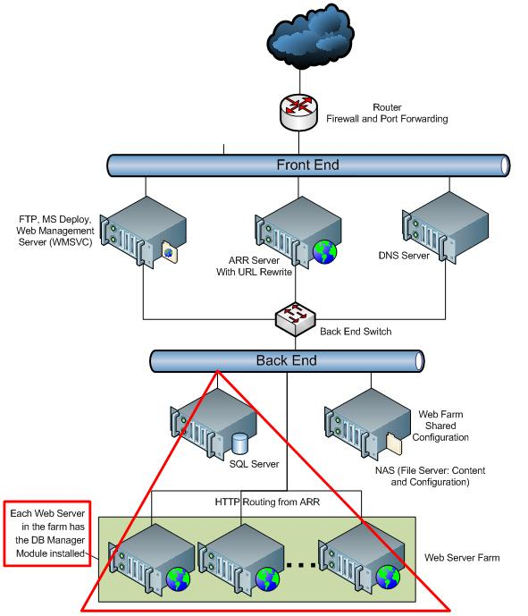
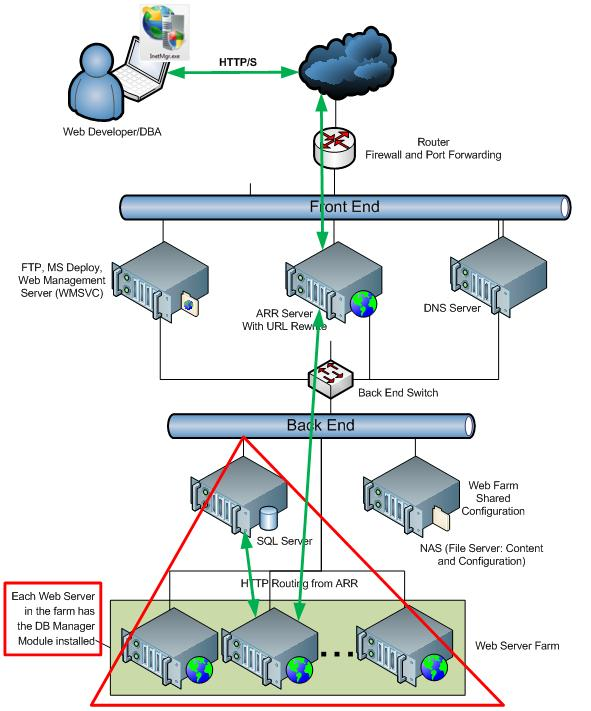
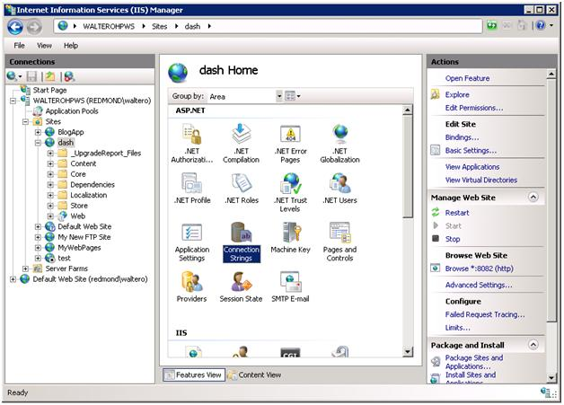
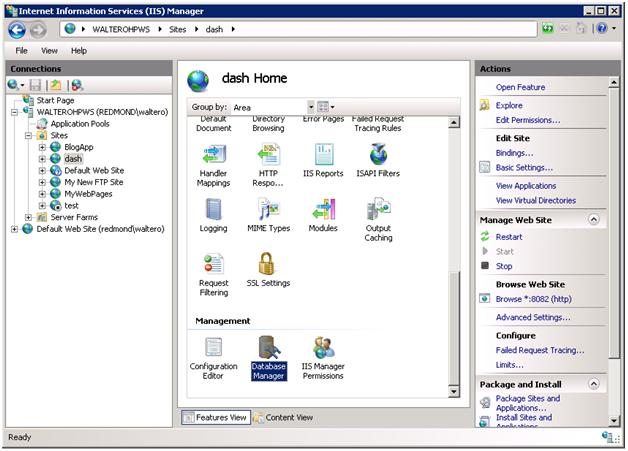
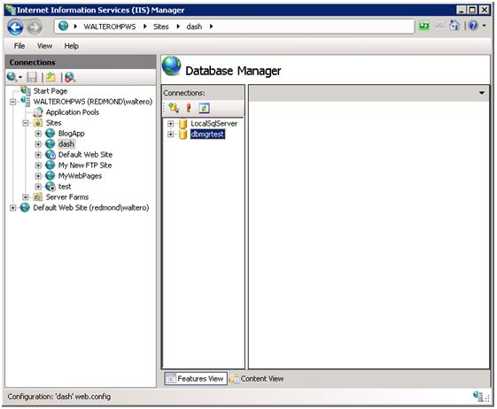

Database Manager for Hosters
====================
by Walter Oliver

## Introduction

Database Manager is a new IIS module specifically designed for the management of databases located in hosting environments. That is, it is designed for environments such as the one provided by Web hosters in which the database servers are intended to be accessible from the Web Application Server but not directly from the Internet. This article provides a guiding map that will help hosters learn about Database Manager and deploy it in hosting environments.

Continue to download &lt;link: [https://www.iis.net/extensions/DatabaseManager](https://www.iis.net/downloads/microsoft/database-manager)&gt;.

## Learn about Database Manager

Many of the database management tools that are currently available require direct access to the servers that they manage. This is not a desired configuration because it enables potential exposure to malicious attacks to the database servers. The IIS Database Manager module solves this issue by acting as a proxy for database management functionality. Hosters who want to make Database Manager available to their customers should install it on each of their Web Server computers, regardless of whether these computers are in a shared hosting Web farm. The image below shows a shared configuration setting with Database Manager installed.

  
   
Since the IIS Database Manager module uses HTTP/S for all its communication with the database server, there is no need to open new ports. As far as the servers are concerned, this is normal HTTP/S traffic that occurs as part of the customer Web site. The image below depicts the communication between the customer -Web Developer (or DBA), and the target database server. Notice that the customer uses IIS Manager (Inetmgr.exe) to access and manage databases for which the account has been provisioned.

## Set Up Database Manager in a Hosting Environment

To install the current version (CTP2) of Database Manager, go to:

- (x86) [https://www.iis.net/downloads/default.aspx?tabid=34&amp;i=1684&amp;g=6](../../../downloads?tabid=34&amp;i=1684&amp;g=6.md)
- (x64) [https://www.iis.net/downloads/default.aspx?tabid=34&amp;i=1685&amp;g=6](../../../downloads?tabid=34&amp;i=1685&amp;g=6.md)

You should make sure that the image you plan to use for your Web server installation contains IIS Database Manager.

## Configuring Database Manager

Users must have a database Connection String created within a site in order to use Database Manager. Here is a summary of steps:

1. A hoster receives an order from a customersfor the provisioning of one or more databases for an application.
2. The hoster creates the database and provides the connection string to the user. This is often an automated step. The connection string includes the database server, database name, and user credentials (user name and password). IIS Manager has a Connection String module that the hoster can use to provide the connection string to the customer. Or the customer can enter the connection string information that is provided by the hoster.  
   
    
3. The user double-clicks the Database Manager icon in the Management section for the Web site.  
   
    
4. The user can manage the database(s) by selecting the appropriate connection.   
   
    
5. For more information about this process and details about Database Manager, see The Basics of Database Manager &lt;link: [https://www.iis.net/learn/extensions/database-manager/use-the-database-manager](../../extensions/database-manager/use-the-database-manager.md)&gt; article. It provides a walkthrough of the process of setting up and using Database Manager in a hosted environment. It covers the following tasks:

- Provisioning a database
- Adding a table
- Managing primary keys
- Managing foreign keys
- Managing data in the table
- Executing custom SQL commands

Here is a screenshot of the Database Manager module during the creation of a table for a connection named "dbmgrtest" and associated to the site "dash."

For a video demonstrating IIS Manager and Database Manager, see: [https://blogs.msdn.com/carlosag/archive/2008/07/07/IIS70RemoteAdministrationAndDatabaseManagerVideo.aspx](https://blogs.msdn.com/carlosag/archive/2008/07/07/IIS70RemoteAdministrationAndDatabaseManagerVideo.aspx) .

## Extending Database Manager

The current implementation of the IIS Database Manager module provides access only to Microsoft SQL Server. However, SQL Server does not have to be the only option; the Database Manager is extensible, and new database providers can be created. The Creating a Database Provider &lt;link: [https://www.iis.net/learn/extensions/database-manager](../../extensions/database-manager.md)&gt; article uses an XML DataSet provider as an example to describe the steps and source code needed to create a database provider.

## Conclusion

This article provides information about what the Database Manager module is, why it is important for Web hosters to offer it to their customers, how to set it up in their hosting environment, and how to extend it to include database providers other than SQL Server.