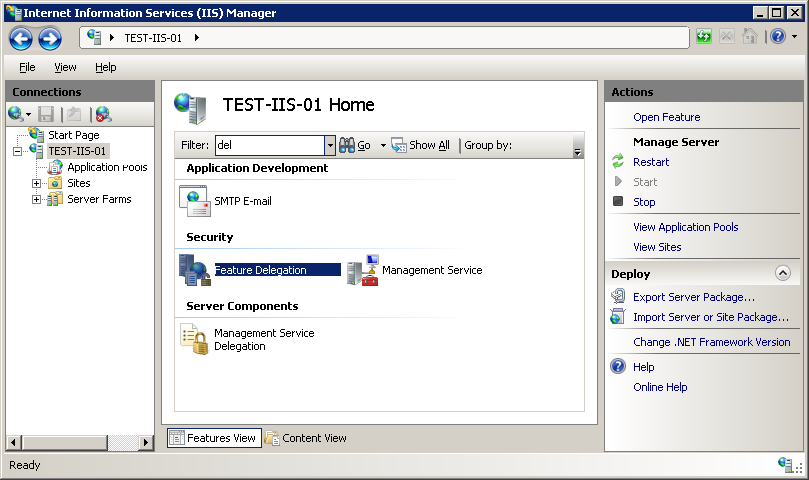
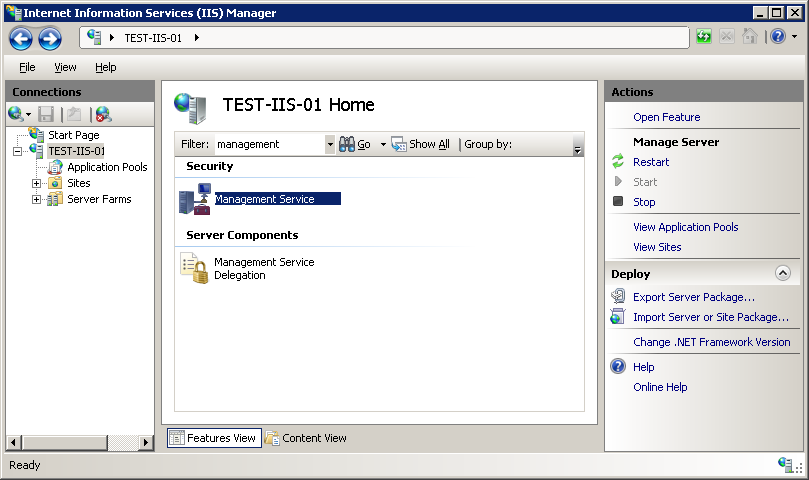
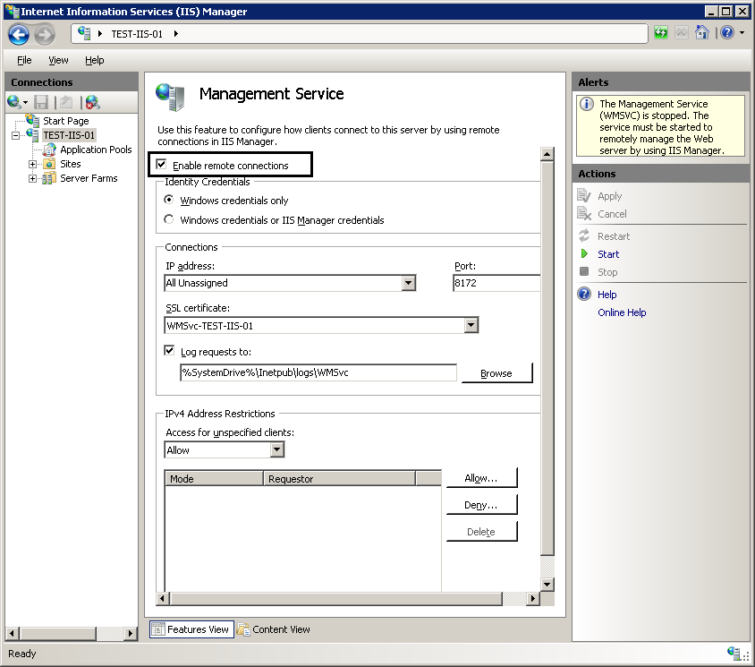

Delegated Administration
====================
by [Walter Oliver](https://github.com/walterov)

The IIS 7 and above administrative user interface, called the IIS Manager, offers a more efficient tool for managing the Web server. It provides support for IIS and ASP.NET configuration settings. It also lets those who host or administer Web sites delegate administrative control to developers or content owners, thus reducing cost of ownership and administrative burden for the server administrator. It supports remote connections over HTTP, and you can use it through a firewall.

For more information about the administration features in IIS, see [Delegating Administration](../../manage/managing-your-configuration-settings/index.md).

Before enabling remote delegation, you should consider what features and properties you want to delegate to site owners.

The following table lists a sample set of features, their delegated settings, and reasons to delegate or not on the Web server. Based on the shared hosting environment that you use, you should develop your own set of delegated features that meet your needs.

> [!NOTE]
> 
> 1. Some of these features may not appear in the list of features to manage if you have not installed them. For example, if you chose not to install Digest authentication, it will not appear in the list on your Web server.
> 2. There will be cases when you want to delegate a particular setting in applicationhost.config without delegating an entire section, here are two key examples:
> 
>     1. [Delegating errorMode in httpErrors](delegating-errormode-in-httperrors.md)
>     2. [Delegating scriptErrorSentToBrowser in ASP](asp.md)

| **Feature** | **Delegated Setting** | **Reason** |
| --- | --- | --- |
| .NET Compilation | Read Only (changed from Read/Write) | Specifies settings for ASP.NET compilation processing directives such as the temporary compilation directory. Prevents users from setting the temporary compilation directory manually. |
| .NET Globalization | Read/Write | Specifies settings for the default culture and globalization properties for Web requests. |
| .NET Profile | Read/Write | Specifies the settings for user selected options in ASP.NET applications. |
| .NET Roles | Configuration Read/Write | Specifies the settings for groups for use with .NET users and forms authentication. |
| .NET Trust Levels | Read Only (changed from Read/Write) | Specifies the trust level. By locking down the trust level when you follow the ASP.NET guidance in this document, you will set this to Read Only and locking it for the server. Prevents Web site owners from setting the trust level to a higher level than that set by the server administrator. For example, if the administrator sets a custom trust level, make this setting Read Only so it cannot be overridden. |
| .NET Users | Configuration Read/Write | Specifies the settings for management of users who belong to roles and that use forms authentication. |
| Application Settings | Read/Write | Specifies the settings for storing data (name and value pairs) that managed code applications use at runtime. |
| ASP | Read Only | Specifies classic ASP settings. |
| ASP.NET Impersonation | Read/Write | Specifies impersonation settings. Site owners can use this to run their site under a different security context. |
| Authentication - Anonymous | Read Only | Specifies anonymous authentication settings. |
| Authentication - Basic | Read Only | Specifies basic authentication settings. |
| Authentication - Digest | Read Only | Specifies digest authentication settings. |
| Authentication - Forms | Read/Write | Specifies forms authentication settings. |
| Authentication - Windows | Read Only | Specifies Windows authentication settings. |
| Authorization Rules | Read/Write | Specifies the list of Allow or Deny rules that control access to content. |
| CGI | Read Only | Specifies the properties for CGI applications. You should leave this setting as Read Only to prevent users from changing settings. |
| Compression | Read/Write | Specifies the settings to configure compression. |
| Connection Strings | Read/Write | Specifies the connection strings that applications use. |
| Default Document | Read/Write | Specifies the default document(s) for the Web site. By making this setting Read/Write, users can specify a custom default document for their site without contacting the server administrator. |
| Directory Browsing | Read/Write | Specifies directory browsing settings. |
| Error Pages | Read Only | Specifies what HTTP error responses are returned. |
| Failed Request Tracing Rules | Read/Write | Specifies settings for failed request tracing rules. Enables users to create rules for tracing requests based on parameters like time taken or status code, and diagnose problems with their site. |
| Feature Delegation | Not Delegated (changed from Read/Write) | Specifies settings for delegating features to applications. It can be turned off unless server administrators want to enable this feature for site owners. |
| Handler Mappings | Read/Write | Specifies the handlers that process requests for certain file types (includes script maps, managed handlers, etc.) |
| HTTP Redirect | Read/Write | Specifies the HTTP redirection settings. |
| HTTP Response Headers | Read/Write | Specifies HTTP headers that are added to responses from the Web server. |
| IPv4 Address and Domain Restrictions | Read Only | Specifies the IP and domain restriction list. |
| ISAPI Filters | Read Only | Specifies ISAPI filters that process requests made to the site or server, such as ASP.NET. |
| Logging | Not Delegated | Specifies the logging settings for the Web server. |
| Machine Key | Read/Write | Specifies hashing and encryption settings for applications services, such as view state, forms authentication and membership and roles. |
| MIME Types | Read Only (changed from Read/Write) | Specifies what file types can be served as static files. |
| Modules | Read/Write | Specifies native and managed code modules that process requests made to the site or server. |
| Output Caching | Read/Write | Specifies rules for caching output. |
| Pages and Controls | Read/Write | Specifies page and control settings for applications. |
| Redirect Rules | Read/Write | Specifies settings for redirecting requests to another file or URL. |
| Session State | Read/Write | Specifies session state and forms authentication cookie settings. |
| SMTP E-mail | Read/Write | Specifies email address and delivery options for email sent from the site. |
| SSL Settings | Read Only | Specifies settings for SSL. |

**To enable the Remote Delegation Service using IIS Manager**

1. Navigate to **Administrative Tools** and click **Internet Information Services (IIS) Manager**.
2. Click the server name node.
3. Double-click the **Feature Delegation** icon.  
    
4. On the **Feature Delegation** page, change any properties that should or should not be delegated.
5. Click the Back button or select the server name node to return to the server feature list.
6. Double-click the **Management Service** icon.  
    
7. On the **Management Service** page, in the **Actions** pane, start the service to enable configuration.
8. **Stop** the service to make changes.
9. Click **Enable remote connections**.  
    
10. Select whether you wish to allow only Windows users or both Windows and membership users.
11. Change the port or certificate if desired.
12. In the **Actions** pane, click **Start** to enable the Remote Delegation service.